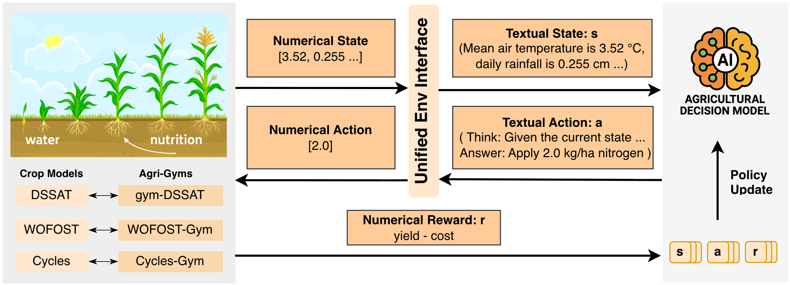

# 🚜 AgriManager



**AgriManager** is a framework that integrates large language models (LLMs) with agricultural reinforcement learning environments to bring semantic reasoning and domain knowledge into crop management.
The goal is to enable models that can reason about environmental conditions and crop states, supporting more interpretable and generalizable decision-making.

**AgriManager** glues together three pillars:
- **Model Interface** -- unified wrappers for OpenAI, Google Gemini, and custom
  (offline/server) vLLM endpoints that expose a simple `generate()` API.
- **Environments** -- adapters that turn crop-management simulators such as
  WOFOST-Gym, CycleGym, and DSSAT-Gym into text interfaces for language-model
  agents and numeric interfaces for supported NN baselines.
- **Training & Inference** -- GRPO training via [VERL](https://github.com/volcengine/verl)
  and batched inference rollouts across many environment configs.

The hosted tabular artifacts are WOFOST-based. CycleGym and DSSAT experiments
are reproduced through executable simulator adapters and scenario-generation
scripts, with DSSAT requiring an optional external runtime installation.

---

## Installation

1. Clone this repository and enter it:

   ```bash
   git clone https://github.com/agrimanager875-ux/agrimanager-code.git AgriManager
   cd AgriManager
   ```

2. Create a clean Conda environment:

   ```bash
   conda create -n agrimanager python=3.12 -y
   conda activate agrimanager
   ```

3. Run the installer:

   ```bash
   bash install.sh
   ```

   This single script handles everything:
   - Initializes the VERL git submodule and installs it (with vLLM/SGLang)
   - Clones and installs WOFOST-Gym at the configured pinned ref under `../AgriManagerExternal/WOFOSTGym`
   - Clones and installs CyclesGym at the configured pinned ref under `../AgriManagerExternal/CyclesGym`
   - Installs AgriManager itself in editable mode

### Operational Requirements

| Path | Purpose | Hardware/runtime |
| --- | --- | --- |
| Docs-only inspection | Artifact review and source inspection | Browser only |
| WOFOST dataset smoke test | Lightweight sanity check for hosted weather-pool rows and adapters | CPU acceptable |
| LLM inference/eval | Model rollout evaluation | CUDA GPU recommended; required for local large-model inference |
| LLM-RL training | Full VERL/GRPO training | Multi-GPU likely for paper-scale runs |
| CycleGym | Native Cycles simulator-backed experiments | External CycleGym/Cycles checkout and bootstrap through `install.sh` |
| DSSAT-Gym | Optional DSSAT-backed experiments | Separate DSSAT-Gym/DSSAT-PDI runtime; setup can take 1-2 hours |

### Optional DSSAT-Gym Setup

DSSAT-Gym/DSSAT-PDI is not installed by `install.sh` because its native DSSAT
runtime setup can take 1-2 hours and is only required for DSSAT-backed
experiments. Users who only need WOFOST-Gym or CycleGym smoke tests can skip
this step.

To run DSSAT-backed dataset generation, training, or evaluation, follow
[docs/gym_dssat_setup.md](docs/gym_dssat_setup.md), then run the DSSAT smoke
tests in [smoke_tests/gym_dssat/README.md](smoke_tests/gym_dssat/README.md).

### Environment Variables

Most users can run `bash install.sh` without setting environment variables. The
variables below are optional overrides unless a specific simulator or hosted
model provider is being used.

| Variable | Required? | Purpose |
| --- | --- | --- |
| `WOFOST_GYM_REMOTE` | Optional | Override the WOFOST-Gym git remote used by `install.sh`. |
| `WOFOST_GYM_REF` | Optional | Override the pinned WOFOST-Gym commit used by `install.sh`. |
| `WOFOST_GYM_PATH` | Optional | Use an existing WOFOST-Gym checkout at runtime. |
| `CYCLES_GYM_REMOTE` | Optional | Override the CycleGym git remote used by `install.sh`. |
| `CYCLES_GYM_REF` | Optional | Override the pinned CycleGym commit used by `install.sh`. |
| `CYCLES_GYM_PATH` | Optional | Use an existing CycleGym checkout at runtime. |
| `DSSAT_GYM_PATH` | Required for DSSAT-Gym only | Path to a DSSAT-Gym/DSSAT-PDI runtime. See `docs/gym_dssat_setup.md`. |
| `OPENAI_API_KEY` | Required for OpenAI models only | API key for OpenAI-backed inference. |
| `GEMINI_API_KEY` | Required for Gemini models only | API key for Gemini-backed inference. |
| `OPENROUTER_API_KEY` | Required for OpenRouter models only | API key for OpenRouter-backed inference. |
| `WANDB_MODE=offline` | Optional | Keep experiment-tracker logging local during smoke runs. |

---

## Documentation

Start with [docs/README.md](docs/README.md).

The main internal docs are split by question:

- [docs/architecture.md](docs/architecture.md) explains the core repository
  boundaries and design rules.
- [docs/experiment_conventions.md](docs/experiment_conventions.md)
  explains how to structure reproducible experiments, smoke tests, and
  SLURM launch files.
- [docs/repository_rules.md](docs/repository_rules.md) explains what
  belongs in git and how code ownership is split between AgriManager and
  external environment repos.
- [docs/dataset_and_generator_sources.md](docs/dataset_and_generator_sources.md) explains the
  three hosted WOFOST datasets, the CycleGym/DSSAT-Gym generator boundary,
  and the external simulator sources used by the dataset and generator
  workflows.
- [docs/environment_adapter_contract.md](docs/environment_adapter_contract.md) explains the environment
  adapter contract and how to add a new env.
- [entrypoints/README.md](entrypoints/README.md) is the direct command
  reference for stable public scripts.

---

## Release And Maintenance

This repository is the anonymized code artifact for review. The submitted
artifact version is tagged as `neurips2026-submission`; use that tag for a
stable code snapshot. Post-submission documentation-only changes are recorded
in [CHANGELOG.md](CHANGELOG.md).

The full public GitHub repository will be released upon acceptance and no later
than the camera-ready deadline. We will maintain a stable release
corresponding to the paper and plan to support the repository for at least two
years after publication by addressing critical issues, fixing reproducibility
bugs, and updating documentation when necessary. No essential component
required to reproduce the benchmark will remain private.

---

## Training

GRPO training powered by VERL. All configuration lives in a single YAML file.

```bash
# Run with default config
bash entrypoints/train/train.sh

# Override any parameter via Hydra key=value
bash entrypoints/train/train.sh \
    actor_rollout_ref.model.path=Qwen/Qwen2.5-3B-Instruct \
    trainer.experiment_name=my_experiment
```

See [entrypoints/README.md](entrypoints/README.md) for direct command usage
and [docs/README.md](docs/README.md) for the full documentation map.

---

## Smoke Example

The canonical WOFOST-Gym smoke tests live in
[smoke_tests/wofost_gym/README.md](smoke_tests/wofost_gym/README.md). To build
the small smoke datasets, run:

```bash
bash smoke_tests/wofost_gym/run_build_datasets.sh
```

Then run the LLM or NN smoke commands documented in that README.

---

## Evaluation

Batched rollout evaluation across environment configurations.

```bash
# Standard evaluation
bash entrypoints/eval/eval.sh
```

Simple baselines such as `random`, `no_action`, and `ag_heuristic` live under
`agrimanager/rollout/inference/`. Their claim boundaries are documented in
[docs/baseline_policy_definitions.md](docs/baseline_policy_definitions.md).

---

## Repo Layout

```
entrypoints/            # Stable public execution entrypoints
├── dataset/            # Dataset build + example dataset configs
├── train/              # LLM and NN training entrypoints + default configs
├── eval/               # LLM and NN evaluation entrypoints + default configs
└── tools/              # User-facing utility entrypoints
experiments/            # Frequently changing experiment wrappers and configs
smoke_tests/            # Environment-level smoke tests with fixed run scripts
integrations/           # AgriManager-side integrations for external environments
install.sh              # Environment bootstrap
agrimanager/            # Python package
├── adapter/            # VERL adapter (agent loop, interactions, trainer, reward)
├── env/                # Environment adapters
├── model_interface/    # Provider configs, models, and server helpers
└── rollout/            # Batch rollout utilities
```
