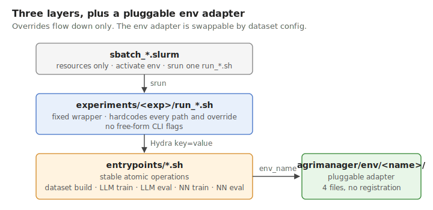

# Architecture

This page explains the design boundaries of AgriManager.

Read this when you want to understand why the repository is split into
`entrypoints/`, `experiments/`, `smoke_tests/`, and `sbatch_*.slurm`.

It focuses on three design decisions:

- the three-layer execution model,
- the rule that overrides only flow downward,
- the env-plug-in model.

Companion docs:

- [experiment_conventions.md](./experiment_conventions.md) covers the
  repository rules for `run_*.sh`, `sbatch_*.slurm`, and experiment layout.
- [environment_adapter_contract.md](./environment_adapter_contract.md)
  covers the env integration contract.

## 1. Three layers, one role each

- **`sbatch_*.slurm`** — requests resources, activates the env, runs one
  `run_*.sh`. Nothing else.
- **`experiments/t1_1_weather_regime_shift/run_*.sh`** — fixed wrappers for concrete runs.
  Hardcodes every path, model, and Hydra override. No `--crop`, no
  `--dataset-config`, no free-form flags.
- **`entrypoints/*.sh`** — the stable atomic operations (build, train,
  eval). This is the API the rest of the repo depends on.

## 2. Overrides flow down only

Experiments override entrypoints. Entrypoints never reach back into
experiments. If you're tempted to add a CLI flag to an entrypoint to cover
a new case — don't. Write a new `run_*.sh` instead.

All overrides are Hydra `key=value`. There is no Tyro, no argparse-custom,
no free-form override passthrough.

## 3. The env adapter is pluggable

Dataset configs carry an `env_name`. The framework does
`importlib.import_module(f"agrimanager.env.{env_name}")` to get the env
code. Shared routers should avoid simulator-specific branches; backend-specific
behavior belongs in the adapter package named by `env_name`.

To add a new env, see
[environment_adapter_contract.md](./environment_adapter_contract.md).
For commands and folder layout, see
[experiment_conventions.md](./experiment_conventions.md).
