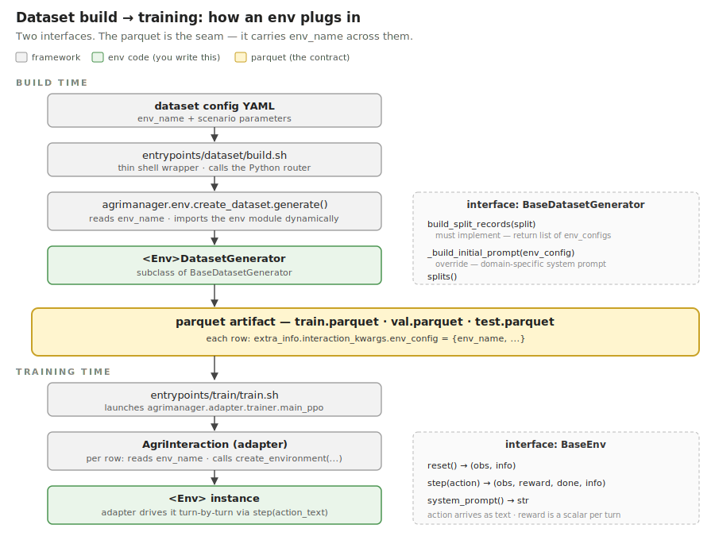
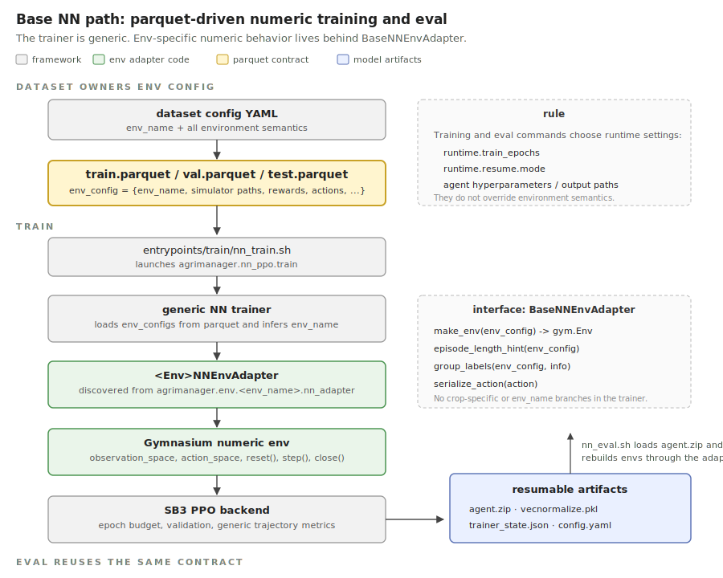

# Environment Adapter Contract

This page defines the extension contract for environment packages such as
`agrimanager/env/wofost_gym/`.

Read this when you are:

- adding a new environment,
- checking what dataset build and rollout expect from env code,
- reviewing where env-specific behavior belongs.

Companion docs:

- [architecture.md](./architecture.md) explains the pluggable env model.
- [experiment_conventions.md](./experiment_conventions.md) explains how
  env datasets, smoke tests, and run scripts fit into the repository.

## What we support today

- **`wofost_gym`** — primary. LLM and NN paths both work.
- **`gym_dssat`** — WIP. LLM path works; pest mechanics are partial; NN
  path is not wired.

Treat `wofost_gym` as the reference; a new env should look the same.

## How an env plugs into training

Build time and training time are chained by the parquet artifact. Each env
sees the framework through three interfaces:

- `BaseDatasetGenerator` for parquet build
- `BaseEnv` for LLM rollout
- `BaseNNEnvAdapter` for framework-native numeric training / eval

Dispatch in all phases keys off a single field: `env_name`.



Two facts make this work:

- **The parquet is self-describing.** Every row carries
  `extra_info.interaction_kwargs.env_config` including `env_name`. Training
  reads the parquet directly without looking up the original dataset YAML.
- **There is no registry.** Both phases call
  `importlib.import_module("agrimanager.env.wofost_gym")` and use
  `agrimanager.env.base.utils.discover_env_classes()` to find the
  `BaseEnv` and `BaseEnvConfig` subclasses. The NN path additionally imports
  an environment package's `nn_adapter` module and discovers a
  `BaseNNEnvAdapter` subclass. Drop a new folder in, it works.

Source: router [agrimanager/env/create_dataset.py](../agrimanager/env/create_dataset.py),
adapter [agrimanager/adapter/interactions/agri_interaction.py](../agrimanager/adapter/interactions/agri_interaction.py),
factory [agrimanager/env/base/utils.py](../agrimanager/env/base/utils.py).

## Required package shape

Create a package such as `agrimanager/env/example_env/` with four files:

| File | What it provides |
|---|---|
| `env.py` | subclass of `BaseEnv` — `reset()`, `step(action)`, `system_prompt()` |
| `env_config.py` | subclass of `BaseEnvConfig` |
| `prompt.py` | `parse_action_response(text) -> Optional[int]` |
| `create_dataset.py` | subclass of `BaseDatasetGenerator` plus a module-level `generate(config, output_dir)` |

That is the full package shape. The framework finds your env by its folder
name via `importlib`.

Base contracts:
[env.py](../agrimanager/env/base/env.py) ·
[env_config.py](../agrimanager/env/base/env_config.py) ·
[create_dataset.py](../agrimanager/env/base/create_dataset.py).

## Runtime contract

Return a **scalar reward every turn**. If your env is trajectory-rewarded,
emit zero on early turns and the trajectory reward on the final turn.
Optional `info` fields: `turn_metrics`, `trajectory_metrics` (final turn
only), `raw_llm_response`.

## Integration checklist

- create `agrimanager/env/example_env/` with the four required files.
- ensure dataset generation writes `env_name` into each parquet row.
- ensure `parse_action_response()` matches the action format in the prompts.
- ensure `step()` returns a scalar reward on every turn.

## Smoke-test it

Copy [`smoke_tests/wofost_gym/`](../smoke_tests/wofost_gym/), swap the env
name and dataset config, and run:

```bash
conda run -n agrimanager bash smoke_tests/wofost_gym/run_build_datasets.sh
conda run -n agrimanager bash smoke_tests/wofost_gym/run_llm_train.sh
conda run -n agrimanager bash smoke_tests/wofost_gym/run_llm_eval_qwen3_4b_instruct.sh
```

A passing smoke-test log belongs in the PR.

## NN path

To support framework-native NN training and eval, add:

- `agrimanager/env/example_env/nn_adapter.py`
- one `BaseNNEnvAdapter` subclass that builds Gymnasium-compatible numeric envs
- optional env-specific numeric wrappers

The adapter contract is intentionally generic. The shared NN trainer reads
the same parquet artifacts as the LLM path, extracts
`extra_info.interaction_kwargs.env_config`, infers `env_name`, and imports
the environment package's `nn_adapter` module. Do not add simulator-specific
branches in the trainer.



Environment configuration is dataset-owned. Anything that changes environment
semantics, such as simulator paths, action scales, reward wrappers, crop-trait
features, prompt/action conventions, weather pools, or scenario construction,
must be written into the dataset config and then materialized into the parquet
`env_config`. Train and eval commands must not override these values. This keeps
train/test decoupled from runtime launch details: the same parquet split always
constructs the same environment.

Minimum NN adapter implementation:

- `make_env(env_config) -> gymnasium.Env`: build a numeric environment with
  SB3-compatible `observation_space`, `action_space`, `reset()`, `step()`, and
  `close()`
- `episode_length_hint(env_config) -> int | None`: optional, but required when
  users train by dataset epoch without an explicit timestep cap
- `group_labels(env_config, info) -> dict[str, str]`: optional labels for
  grouped metric aggregation; the default reads `trajectory_group_labels` from
  `env_config` and fields such as `group_label/crop` or `group_label/regime`
  from `info`
- `serialize_action(action)`: optional JSON serialization hook for rollout
  outputs; override it if the environment uses structured actions

NN environments should put episode-level numeric metrics in
`info["trajectory_metrics"]` on the terminal step. The generic trainer logs any
numeric key it finds there; it does not know about crop-specific names such as
`final_wso`.

The shared runtime entrypoints are:

- `entrypoints/train/nn_train.sh`
- `entrypoints/eval/nn_eval.sh`

NN train/eval configs should only contain runtime and optimization choices:
epoch count, algorithm hyperparameters, experiment name, checkpoint path,
resume mode, logging, device, and output directory. The current default
algorithm is PPO via `agent.type=PPO`.

NN training supports dataset-level epochs through `runtime.train_epochs`. One epoch
means one completed episode for every scenario in the train parquet. This mode
requires `runtime.sample_with_replacement=false`; with multiple env workers,
also set `runtime.shard_train_scenarios_across_envs=true` so epochs refer to the
global train split rather than duplicated per-worker passes. If
`agent.total_timesteps` is omitted, the trainer derives a safety cap from
`BaseNNEnvAdapter.episode_length_hint()`.

Validation defaults to epoch-relative scheduling. With
`runtime.validation.frequency=null`, `runtime.validation.evals_per_epoch`
controls the approximate number of validation runs per dataset epoch; the
trainer converts it to a global-timestep frequency using the adapter's episode
length hints. Set `runtime.validation.frequency` to an integer only when a run
needs an explicit timestep interval.

NN resume is controlled by `runtime.resume.mode`:

- `never`: always start a fresh run
- `auto_latest`: resume the latest complete checkpoint under
  `output.save_folder/checkpoints/step_*`
- `path`: resume the checkpoint directory or `agent.zip` named by
  `runtime.resume.path`

Each resumable checkpoint contains:

```text
agent.zip
vecnormalize.pkl
trainer_state.json
config.yaml
```

Resume is intentionally strict. The checkpoint must match the current env name,
train/val parquet paths, scenario counts, worker count, sharding mode, and epoch
setting; otherwise start a new output directory.

Legacy env-specific NN bridges may still exist under `integrations/`, but new
NN work should target the generic `BaseNNEnvAdapter` path.

## Boundary rules

- Env-specific code lives under packages such as `agrimanager/env/wofost_gym/`.
  Shared base code
  should only contain generic contracts/helpers that every environment can use.
- No `if env_name == ...` branches anywhere. Dispatch goes through
  `agrimanager.env.base.utils.create_environment()`.
- Do not modify [`verl/`](../verl/) for environment integration.
